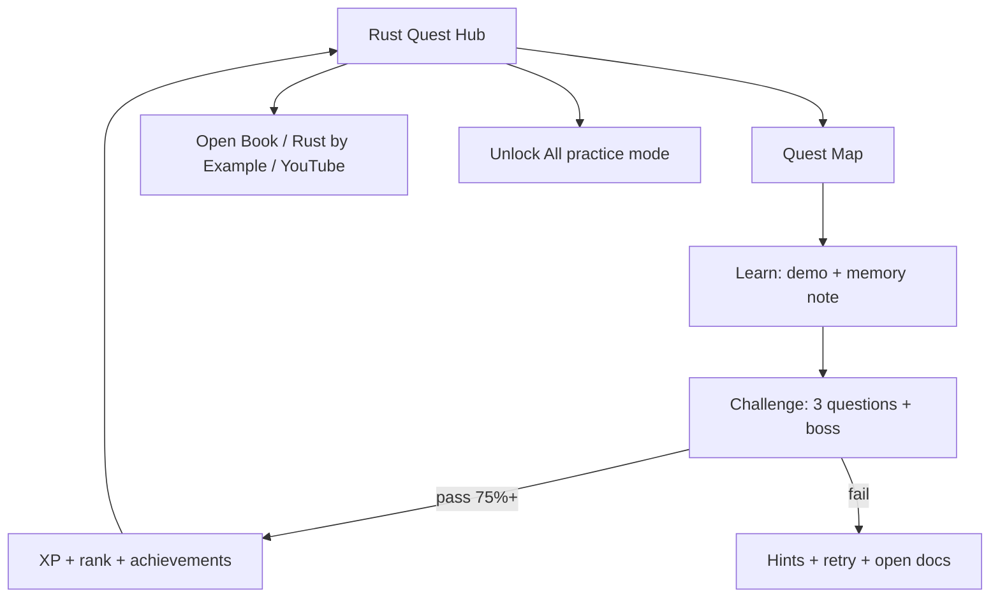
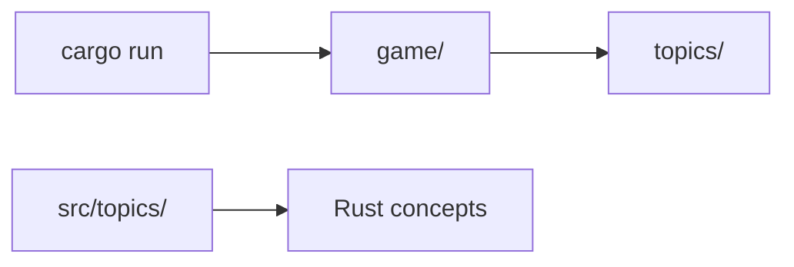

# Rust Quest 🦀⚔️

> **Dedicated to Ayush** — built to help you learn Rust by playing a game and reading the source. You've got this. 🏆

A retro terminal adventure that teaches Rust through **14 quests**, runnable demos, quizzes, ranks, and links to official docs. The codebase is heavily commented so you can learn *how the game works* while learning *how Rust works*.

---

## Quick start

**Prerequisites:** [rustup](https://rustup.rs/) (includes `cargo`). Use **Windows Terminal**, **WezTerm**, or **iTerm2** for emoji and colors.

```bash
cd rust-quest
cargo run          # start Rust Quest
cargo test         # run tests
cargo doc --open   # browse annotated API docs
```

On first launch you enter the **hub**, pick quests from the crossterm **quest map**, and progress is saved to `.rust-test/progress.json`.

**Contributing?** See [CONTRIBUTING.md](CONTRIBUTING.md). AI/agent contributors: see [AGENTS.md](AGENTS.md).

---

## How it works



Each quest follows four steps:

1. **Learn** — see Rust concepts run with explanations
2. **Challenge** — 4 questions (3 + boss); need **≥75%** to pass
3. **Reward** — XP (once per step), rank checks, badges
4. **Explore** — optional links in your browser

**Hub menu:** Quest Map · Profile · Resources · Sandbox · Book study guide · Unlock All · Reset · **Music** · Quit

Background music plays from `assets/music/` (MP3). Choose a fixed track or **cycle per quest** from the Music menu; mute is saved separately.

**Quest map:** `↑`/`↓` move · `Enter` select · `Esc` back

---

## Quest map (14 quests)

| # | Quest | Topics |
|---|-------|--------|
| 1 | 📦 Cargo | `build`, `run`, `test`, `doc`, manifest |
| 2 | 🔢 Types | primitives, mutability, tuples, arrays |
| 3 | 🦀 Ownership | move, borrow, slices |
| 4 | 🏗️ Structs & Enums | `match`, `impl`, `derive` |
| 5 | ⚠️ Errors | `Option`, `Result`, `?` |
| 6 | 📚 Collections | `Vec`, `String`, `HashMap` |
| 7 | ⚡ Traits & Generics | traits, bounds, `impl Trait` |
| 8 | ⏳ Lifetimes | `'a`, elision, struct lifetimes |
| 9 | 🗂️ Modules & Prelude | `mod`, `pub`, `use`, prelude |
| 10 | 🔄 Iterators & Closures | `map`, `filter`, closures |
| 11 | 🧠 Smart Pointers | `Box`, `Rc`, `Arc`, `RefCell` |
| 12 | 🧵 Concurrency | threads, `Mutex`, `Send`/`Sync` |
| 13 | ✅ Testing & Docs | `#[test]`, `cargo doc` |
| 14 | 🚀 Advanced Cargo | features, workspaces |

Quests unlock in order. **Unlock All** lets you practice without waiting.

---

## Epic phases & dungeon bosses

Quests are grouped into **four story arcs** tied to [The Rust Book](https://doc.rust-lang.org/book/). When you finish the last quest in a phase, a **dungeon boss** fight unlocks — a mixed quiz using each quest’s boss question from that phase (≥75% to win, +50 bonus XP).

| Phase | Quests | Boss | Book chapters |
|-------|--------|------|----------------|
| **The Cellar** — Foundations | Cargo → Errors (5) | 👹 Borrow Checker Warden | Ch 1–6, 9 |
| **The Archives** — Abstractions | Collections → Lifetimes (3) | 🗿 Generic Golem | Ch 8, 10 |
| **The Forge** — Craft | Modules → Smart Pointers (3) | 👻 Closure Phantom | Ch 7, 13, 15–16 |
| **The Summit** — Mastery | Concurrency → Advanced Cargo (3) | 🐉 Thread Dragon | Ch 11–12, 14 |

Complete all **14 quests** to become **👑 Rust Quest Champion** — a full victory celebration with treasure, potions, and a nudge to revisit every quest and resource link.

**Book study guide** (hub menu): topics we don’t have a dedicated quest for yet — control flow, functions, pattern depth, macros intro — with links into the book.

---

## Ranks & progress

Ranks unlock when you **complete** quests (challenge passed), not from XP alone.

| Rank | Requirement |
|------|-------------|
| 🥚 Initiate | Start playing |
| 📦 Cargo Runner | Complete Cargo |
| 🦀 Memory Keeper | Complete Ownership |
| ⚔️ Pattern Knight | Complete Structs & Enums |
| 🛡️ Error Handler | Complete Errors |
| 📚 Collection Hero | Complete Collections |
| ⚡ Trait Master | Complete Traits & Generics |
| ⏳ Lifetime Sage | Complete Lifetimes |
| 🗂️ Module Architect | Complete Modules & Prelude |
| 👑 Rust Quest Champion | Complete all 14 quests |

XP (+15 learn, +25 challenge) fills a progress bar. **Streak** counts consecutive days you complete a step. Progress file: `.rust-test/progress.json` (safe to delete to start over).

---

## Commands

| Command | Purpose |
|---------|---------|
| `cargo run` | Play Rust Quest |
| `cargo run --example ownership` | Run one quest demo |
| `cargo test` | Run game + topic tests |
| `cargo doc --open` | Read rustdoc |
| `cargo check` | Fast compile check |

Examples exist for every quest: `cargo run --example cargo`, `--example types`, etc.

---

## Testing

| Command | Purpose |
|---------|---------|
| `.\scripts\run_tests.ps1` | Full suite on Windows |
| `./scripts/run_tests.sh` | Same on macOS/Linux |
| `cargo test` | Unit + integration + doc tests |
| `cargo test -- --nocapture` | Show test output |

**Test types:** unit tests in `src/game/*.rs`, integration tests in `tests/`, doc tests in `///` comments.

---

## Project layout

```text
.
├── Cargo.toml
├── README.md
├── CONTRIBUTING.md
├── AGENTS.md
├── assets/music/          ← background MP3 tracks
├── src/
│   ├── main.rs
│   ├── game/
│   ├── topics/
│   └── resources/links.rs
├── examples/
├── tests/
└── scripts/
```



---

## Reading the source code

Suggested order for Ayush:

1. [`src/main.rs`](src/main.rs) — startup flow
2. [`src/game/state.rs`](src/game/state.rs) — unlocks, XP, ranks
3. [`src/game/ui/map.rs`](src/game/ui/map.rs) — crossterm quest map
4. [`src/topics/registry.rs`](src/topics/registry.rs) — quest list
5. Any file in [`src/topics/`](src/topics/) for a quest you played
6. [`src/game/ui/retro.rs`](src/game/ui/retro.rs) — terminal styling

Look for comment prefixes:

- `// LEARN:` — Rust concept explained
- `// GAME:` — why this game code exists

---

## Official learning links

| Topic | The Rust Book | Rust by Example |
|-------|---------------|-----------------|
| Cargo | [Hello Cargo](https://doc.rust-lang.org/book/ch01-03-hello-cargo.html) | [Crates](https://doc.rust-lang.org/rust-by-example/cargo.html) |
| Types | [Variables](https://doc.rust-lang.org/book/ch03-01-variables-and-mutability.html) | [Variables](https://doc.rust-lang.org/rust-by-example/variable_bindings.html) |
| Ownership | [Ch. 4](https://doc.rust-lang.org/book/ch04-00-understanding-ownership.html) | [Ownership](https://doc.rust-lang.org/rust-by-example/scope/move.html) |
| Structs & Enums | [Ch. 5–6](https://doc.rust-lang.org/book/ch05-00-structs.html) | [Structs](https://doc.rust-lang.org/rust-by-example/custom_types/structs.html) |
| Errors | [Ch. 9](https://doc.rust-lang.org/book/ch09-00-error-handling.html) | [Error](https://doc.rust-lang.org/rust-by-example/error.html) |
| Collections | [Ch. 8](https://doc.rust-lang.org/book/ch08-00-common-collections.html) | [Vector](https://doc.rust-lang.org/rust-by-example/std/vec.html) |
| Traits | [Ch. 10](https://doc.rust-lang.org/book/ch10-00-generics.html) | [Traits](https://doc.rust-lang.org/rust-by-example/trait.html) |
| Lifetimes | [Lifetimes](https://doc.rust-lang.org/book/ch10-03-lifetime-syntax.html) | [Lifetimes](https://doc.rust-lang.org/rust-by-example/scope/lifetime.html) |
| Modules | [Ch. 7](https://doc.rust-lang.org/book/ch07-00-managing-growing-projects-with-packages-crates-and-modules.html) | [Modules](https://doc.rust-lang.org/rust-by-example/mod.html) |
| Iterators | [Ch. 13](https://doc.rust-lang.org/book/ch13-00-functional-features.html) | [Iterators](https://doc.rust-lang.org/rust-by-example/trait/iter.html) |
| Smart pointers | [Ch. 15](https://doc.rust-lang.org/book/ch15-00-smart-pointers.html) | [Rc](https://doc.rust-lang.org/rust-by-example/std/rc.html) |
| Concurrency | [Ch. 16](https://doc.rust-lang.org/book/ch16-00-concurrency.html) | [Threads](https://doc.rust-lang.org/rust-by-example/std_misc/threads.html) |
| Testing | [Ch. 11](https://doc.rust-lang.org/book/ch11-00-testing.html) | [Tests](https://doc.rust-lang.org/rust-by-example/testing/unit_testing.html) |

More: [The Rust Book](https://doc.rust-lang.org/book/) · [Rust by Example](https://doc.rust-lang.org/rust-by-example/) · [std docs](https://doc.rust-lang.org/std/)

---

## Appendix: common borrow-checker errors

| Error pattern | Meaning | Fix |
|---------------|---------|-----|
| use of moved value | ownership transferred | clone, borrow `&T`, or redesign |
| cannot borrow as mutable twice | two `&mut` at once | narrow scope, use references sequentially |
| borrowed value does not live long enough | dangling reference | extend owner lifetime or return owned data |
| `Send` / `Sync` trait bound | unsafe thread sharing | use `Arc<Mutex<T>>`, understand sharing rules |

---

## Contributing

We welcome bug fixes, quest improvements, narrative polish, tests, and docs.

- **[CONTRIBUTING.md](CONTRIBUTING.md)** — setup, PR checklist, code style, how to add quests and music
- **[AGENTS.md](AGENTS.md)** — architecture and constraints for AI coding agents

Run `.\scripts\run_tests.ps1` (Windows) or `./scripts/run_tests.sh` before opening a PR.

---

## License

MIT — see [LICENSE-MIT](LICENSE-MIT).

---

*For Ayush: play one quest a day, read the matching source file, and follow the book link when a quiz stumps you. See you at 👑 Rust Quest Champion.*
