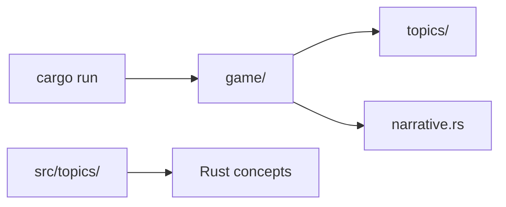

# Rust Quest 🧙⚔️

**Version 1.0.0**

A retro terminal adventure that teaches Rust through **14 quests**, runnable demos, quizzes, ranks, dungeon bosses, and links to official docs. The codebase is heavily commented so you can learn *how the game works* while learning *how Rust works*.

🕯️ *The Dungeon Master speaks:* Shadows of bad code creep across the **Kingdom of Rust**. Only a brave hero who masters ownership, traits, and the borrow checker can restore the realm. Sync this repo, run `cargo run`, and step through the mossy gate — your legend begins at the hub campfire.

> **Version:** `[package].version` in [`Cargo.toml`](Cargo.toml) is the source of truth (currently **1.0.0**). The hub reads it via [`src/version.rs`](src/version.rs). Releases are bumped by the [**Bump version**](./.github/workflows/bump-version.yml) GitHub Action — no binaries are published; clone and `cargo run`.

**Your kit:** 🧙 wizard · ⚔️🛡️ combat · 🕯️ torchlight · 📜 scrolls · 🧭🗺️ quest map · 💣 logic bombs · 🔥 streak flame · 🎲 Dungeon Master · ❤️ hearts

---

## Quick Start — Answer the call

**Prerequisites:** [rustup](https://rustup.rs/) (includes `cargo`). Use **Windows Terminal**, **WezTerm**, or **iTerm2** for emoji and colors.

```bash
git clone <your-fork-or-repo-url>
cd rust-quest
cargo run          # enter the hub — the Dungeon Master welcomes you
cargo test         # run tests
cargo doc --open   # browse annotated API docs
```

On first launch you enter the **hub** with a **🎲 Dungeon Master** intro inviting you to save the Kingdom of Rust. Pick quests from the crossterm **🧭 Quest Map 🗺️**, and progress is saved to `.rust-test/progress.json`.

**Contributing?** See [CONTRIBUTING.md](CONTRIBUTING.md). **AI / agent contributors:** see [AGENTS.md](AGENTS.md) for architecture, save format, and safe edit boundaries.

> **Dedicated to Ayush** — built to help you learn Rust by playing a game and reading the source. You've got this. 🏆


---

## What's New

<!-- bump-release:whats-new -->

### v1.0.0 — 2026-06-27

**Gameplay & systems**

- Hearts vitality system (quiz, healing potions, save schema v6)
- Background music with fixed, cycle-on-quest, and mute modes
- Auto-chain to the next quest after passing a challenge

**Progress & save**

- Versioned JSON progress with music and hearts persistence

**Quests & learning**

- 14 quests with demos, shuffled quizzes, and boss questions

**Story & narrative**

- Dungeon Master hub intro, per-quest rooms, four epic phase bosses

See [Game Features (v1.0.0)](#game-features-v100) for the full catalog.

---

## Game Features (v1.0.0)

### Core learning loop

| Feature | What it does |
|---------|----------------|
| **14 quests** | Cargo → Advanced Cargo; sequential unlock, demos, memory-safety notes, official doc links |
| **Learn / Challenge / Resources** | Study runes (+15 XP once), quiz foe (+25 XP), open book & video scrolls in-browser |
| **Quest map** | Crossterm map — pick rooms, auto-chain to the next quest after a passed challenge |
| **Sandbox** | Replay any quest demo without XP pressure |
| **Practice mode** | **Unlock All** skips the sequential lock for replay |
| **14 `cargo run --example …`** | Standalone runnable demos per topic |

### Quizzes, hearts & bosses

| Feature | What it does |
|---------|----------------|
| **Challenge quizzes** | 4 questions per quest (3 + boss); choices shuffled; **≥75%** to pass |
| **Hearts (vitality)** | Start with 3 ❤️ (max 5); wrong answers −1, correct +1; saved in progress |
| **Weakened state** | At 0 hearts you cannot fight — DM directs you to heal first |
| **Healing potions** | Restore hearts via **Learn**, **Resources** links, post-quiz book chapters, book study guide |
| **Epic dungeon bosses** | Four phase bosses after each arc — mixed boss quizzes, **+50 bonus XP** |
| **Achievements** | e.g. No Panic, Borrow Slayer, phase boss clears, Full Stack Rustacean |

### Progress & persistence

| Feature | What it does |
|---------|----------------|
| **10 ranks** | Initiate → Champion; tied to **quest completion**, not XP alone |
| **XP bar & streak** | XP once per learn/challenge step; 🔥 streak for consecutive play days |
| **JSON save** | `.rust-test/progress.json` — versioned schema with migrations (hearts, music, bosses, …) |
| **Champion victory** | One-time celebration when all 14 quests are cleared |
| **Book study guide** | Hub menu list of book topics outside the 14 quests, with links |

### Story & narrative

| Feature | What it does |
|---------|----------------|
| **Dungeon Master hub intro** | Welcome lore for new heroes; nudge toward the next unfinished quest on return |
| **Per-quest rooms** | Room arrival, foe taunts, learn/challenge copy in [`narrative.rs`](src/game/narrative.rs) |
| **Four epic phases** | The Cellar, Archives, Forge, Summit — each with a named boss and book chapter tie-in |
| **Post-quiz book prompt** | Offer The Rust Book chapter after a pass (defaults **Yes** if any answer was wrong) |

### Resources & Audio

| Feature | What it does |
|---------|----------------|
| **Resource browser** | Per-quest Rust Book, Rust by Example, std docs, YouTube — hub or in-quest |
| **Background music** | MP3 auto-discovery in `assets/music/` — **fixed** track, **cycle on quest start**, or **mute** (saved) |
| **Pinned track** | Fixed mode keeps playing across quests without restarting from 0:00 |

Full agent-oriented details: **[AGENTS.md](AGENTS.md)**.

---

## Planned Features

| Priority | Feature | Goal |
|----------|---------|------|
| 🔮 | **More lore** | Deeper DM copy, room descriptions, phase and boss storylines |
| 🔮 | **Richer quizzes & bosses** | Harder questions, varied boss mechanics, better feedback tied to mistakes |
| 🔮 | **Broader topic coverage** | Stronger beginner → intermediate path (and room to grow beyond) |
| 🔮 | **Difficulty setting** | **Easy / Normal / Hard** — select beginner, intermediate, or advanced topic depth per run |

Contributions welcome — see [CONTRIBUTING.md](CONTRIBUTING.md).

---

## How to play

*Main Menu - Hub (Player stats, Dungeon Master intro, hearts) wraps every return to the Main Menu. Pick quest steps in any order; Learn before Challenge is recommended.*

**Hub menu:** 🧭 Quest Map · 📜 Resources · 🛠️ Sandbox · 📖 Book study guide · 🔓 Unlock All · 💾 Reset · 🎼 Music · ☕ Quit

Each quest follows four steps:

1. **💡 Learn** — see Rust concepts run with explanations (+15 XP once; lore potion when weakened)
2. **⚔️ Challenge** — 4 questions (3 + boss); need **≥75%** to pass; hearts rise and fall with answers
3. **🔥 Reward** — XP, rank checks, achievements; auto-advance to the next quest on pass
4. **📖 Explore** — optional links in your browser (scrolls also restore hearts when below max)

Background music plays from `assets/music/` (MP3). Choose a fixed track or **cycle per quest** from the Music menu; mute is saved separately.

**Quest map:** `↑`/`↓` move · `Enter` select · `Esc` back

---

## Quest Map (14 quests)

| # | Quest | Topics |
|---|-------|--------|
| 1 | 📦 Cargo | `build`, `run`, `test`, `doc`, manifest |
| 2 | 🔢 Types | primitives, mutability, tuples, arrays |
| 3 | 🦀 Ownership | move, borrow, slices |
| 4 | 🏗️ Structs & Enums | `match`, `impl`, `derive` |
| 5 | ⚠️ Errors | `Option`, `Result`, `?` |
| 6 | 📚 Collections | `Vec`, `String`, `HashMap` |
| 7 | ⚡ Traits & Generics | traits, bounds, `impl Trait` |
| 8 | ⏳ Lifetimes | `'a`, elision, struct lifetimes |
| 9 | 🗂️ Modules & Prelude | `mod`, `pub`, `use`, prelude |
| 10 | 🔄 Iterators & Closures | `map`, `filter`, closures |
| 11 | 🧠 Smart Pointers | `Box`, `Rc`, `Arc`, `RefCell` |
| 12 | 🧵 Concurrency | threads, `Mutex`, `Send`/`Sync` |
| 13 | ✅ Testing & Docs | `#[test]`, `cargo doc` |
| 14 | 🚀 Advanced Cargo | features, workspaces |

Quests unlock in order. **🔓 Unlock All** lets you practice without waiting.

---

## Epic phases & Dungeon Bosses

Quests are grouped into **four story arcs** tied to [The Rust Book](https://doc.rust-lang.org/book/). When you finish the last quest in a phase, a **dungeon boss** fight unlocks — a mixed quiz using each quest’s boss question from that phase (≥75% to win, +50 bonus XP).

| Phase | Quests | Boss | Book chapters |
|-------|--------|------|----------------|
| **The Cellar** — Foundations | Cargo → Errors (5) | 👹 Borrow Checker Warden | Ch 1–6, 9 |
| **The Archives** — Abstractions | Collections → Lifetimes (3) | 🗿 Generic Golem | Ch 8, 10 |
| **The Forge** — Craft | Modules → Smart Pointers (3) | 👻 Closure Phantom | Ch 7, 13, 15–16 |
| **The Summit** — Mastery | Concurrency → Advanced Cargo (3) | 🐉 Thread Dragon | Ch 11–12, 14 |

Complete all **14 quests** to become **👑 Rust Quest Champion** — a full victory celebration with treasure, potions, and a nudge to revisit every quest and resource link.

**📖 Book study guide** (hub menu): topics we don’t have a dedicated quest for yet — control flow, functions, pattern depth, macros intro — with links into the book.

---

## Ranks & Progress

Ranks unlock when you **complete** quests (challenge passed), not from XP alone.

| Rank | Requirement |
|------|-------------|
| 🥚 Initiate | Start playing |
| 📦 Cargo Runner | Complete Cargo |
| 🦀 Memory Keeper | Complete Ownership |
| ⚔️ Pattern Knight | Complete Structs & Enums |
| 🛡️ Error Handler | Complete Errors |
| 📚 Collection Hero | Complete Collections |
| ⚡ Trait Master | Complete Traits & Generics |
| ⏳ Lifetime Sage | Complete Lifetimes |
| 🗂️ Module Architect | Complete Modules & Prelude |
| 👑 Rust Quest Champion | Complete all 14 quests |

XP (+15 learn, +25 challenge) fills a progress bar. **❤️ Hearts** (3–5) track quiz vitality — heal via Learn, Resources, or book chapters. **🔥 Streak** counts consecutive days you complete a step. Progress file: `.rust-test/progress.json` (schema v6; safe to delete to start over).

---

## In-game Resources (📜 hub menu)

From the hub, open **📜 Resources — open lore scrolls** to launch browser links per quest — the same scrolls available inside each quest’s **📖 Consult scrolls** step.

| Scroll | Opens |
|--------|--------|
| 📖 **The Rust Book** | Official book chapter for that quest |
| 📜 **Rust by Example** | Runnable examples for the topic |
| 📖 **std docs** | Standard library docs (when linked) |
| 📜 **YouTube scrolls** | Curated video links per quest |

**Always-on references** (also linked throughout quests):

- [The Rust Book](https://doc.rust-lang.org/book/) — primary lore
- [Rust by Example](https://doc.rust-lang.org/rust-by-example/) — short runnable lessons
- [Standard library (`std`)](https://doc.rust-lang.org/std/) — API reference
- [Rust Reference](https://doc.rust-lang.org/reference/) — language details
- [rustup.rs](https://rustup.rs/) — install the toolchain and begin your journey

Per-quest URLs live in [`src/resources/links.rs`](src/resources/links.rs) and each `src/topics/*.rs` file.

---

## Commands

| Command | Purpose |
|---------|---------|
| `cargo run` | Play Rust Quest |
| `cargo run --example ownership` | Run one quest demo |
| `cargo test` | Run game + topic tests |
| `cargo doc --open` | Read rustdoc |
| `cargo check` | Fast compile check |

Examples exist for every quest: `cargo run --example cargo`, `--example types`, etc.

---

## Testing

| Command | Purpose |
|---------|---------|
| `.\scripts\run_tests.ps1` | Full suite on Windows |
| `./scripts/run_tests.sh` | Same on macOS/Linux |
| `cargo test` | Unit + integration + doc tests |
| `cargo test -- --nocapture` | Show test output |

**Test types:** unit tests in `src/game/*.rs`, integration tests in `tests/`, doc tests in `///` comments.

---

## Project layout

```text
.
├── Cargo.toml             ← bump [package].version for releases (currently 1.0.0)
├── README.md
├── CONTRIBUTING.md
├── AGENTS.md              ← architecture for AI agents
├── assets/music/          ← background MP3 tracks
├── src/
│   ├── main.rs
│   ├── version.rs         ← VERSION from Cargo.toml
│   ├── game/
│   │   ├── hub.rs         ← hub + menus
│   │   ├── narrative.rs   ← DM room lore
│   │   └── ui/retro.rs    ← boxes, title banner, main menu frame
│   ├── topics/
│   └── resources/links.rs ← quest URL table
├── examples/
├── tests/
└── scripts/
```



---

## Reading the source code

Suggested order for Ayush:

1. [`src/main.rs`](src/main.rs) — startup flow
2. [`src/game/state.rs`](src/game/state.rs) — unlocks, XP, ranks
3. [`src/game/ui/map.rs`](src/game/ui/map.rs) — crossterm quest map
4. [`src/game/narrative.rs`](src/game/narrative.rs) — Dungeon Master encounter copy
5. [`src/topics/registry.rs`](src/topics/registry.rs) — quest list
6. Any file in [`src/topics/`](src/topics/) for a quest you played
7. [`src/game/ui/retro.rs`](src/game/ui/retro.rs) — terminal styling and boxes

Look for comment prefixes:

- `// LEARN:` — Rust concept explained
- `// GAME:` — why this game code exists

Agent contributors: start with **[AGENTS.md](AGENTS.md)** before editing hub, save format, or quest registry.

---

## Official learning links

| Topic | The Rust Book | Rust by Example |
|-------|---------------|-----------------|
| Cargo | [Hello Cargo](https://doc.rust-lang.org/book/ch01-03-hello-cargo.html) | [Crates](https://doc.rust-lang.org/rust-by-example/cargo.html) |
| Types | [Variables](https://doc.rust-lang.org/book/ch03-01-variables-and-mutability.html) | [Variables](https://doc.rust-lang.org/rust-by-example/variable_bindings.html) |
| Ownership | [Ch. 4](https://doc.rust-lang.org/book/ch04-00-understanding-ownership.html) | [Ownership](https://doc.rust-lang.org/rust-by-example/scope/move.html) |
| Structs & Enums | [Ch. 5–6](https://doc.rust-lang.org/book/ch05-00-structs.html) | [Structs](https://doc.rust-lang.org/rust-by-example/custom_types/structs.html) |
| Errors | [Ch. 9](https://doc.rust-lang.org/book/ch09-00-error-handling.html) | [Error](https://doc.rust-lang.org/rust-by-example/error.html) |
| Collections | [Ch. 8](https://doc.rust-lang.org/book/ch08-00-common-collections.html) | [Vector](https://doc.rust-lang.org/rust-by-example/std/vec.html) |
| Traits | [Ch. 10](https://doc.rust-lang.org/book/ch10-00-generics.html) | [Traits](https://doc.rust-lang.org/rust-by-example/trait.html) |
| Lifetimes | [Lifetimes](https://doc.rust-lang.org/book/ch10-03-lifetime-syntax.html) | [Lifetimes](https://doc.rust-lang.org/rust-by-example/scope/lifetime.html) |
| Modules | [Ch. 7](https://doc.rust-lang.org/book/ch07-00-managing-growing-projects-with-packages-crates-and-modules.html) | [Modules](https://doc.rust-lang.org/rust-by-example/mod.html) |
| Iterators | [Ch. 13](https://doc.rust-lang.org/book/ch13-00-functional-features.html) | [Iterators](https://doc.rust-lang.org/rust-by-example/trait/iter.html) |
| Smart pointers | [Ch. 15](https://doc.rust-lang.org/book/ch15-00-smart-pointers.html) | [Rc](https://doc.rust-lang.org/rust-by-example/std/rc.html) |
| Concurrency | [Ch. 16](https://doc.rust-lang.org/book/ch16-00-concurrency.html) | [Threads](https://doc.rust-lang.org/rust-by-example/std_misc/threads.html) |
| Testing | [Ch. 11](https://doc.rust-lang.org/book/ch11-00-testing.html) | [Tests](https://doc.rust-lang.org/rust-by-example/testing/unit_testing.html) |

More: [The Rust Book](https://doc.rust-lang.org/book/) · [Rust by Example](https://doc.rust-lang.org/rust-by-example/) · [std docs](https://doc.rust-lang.org/std/) · [Rust Reference](https://doc.rust-lang.org/reference/)

---

## Appendix: common borrow-checker errors

| Error pattern | Meaning | Fix |
|---------------|---------|-----|
| use of moved value | ownership transferred | clone, borrow `&T`, or redesign |
| cannot borrow as mutable twice | two `&mut` at once | narrow scope, use references sequentially |
| borrowed value does not live long enough | dangling reference | extend owner lifetime or return owned data |
| `Send` / `Sync` trait bound | unsafe thread sharing | use `Arc<Mutex<T>>`, understand sharing rules |

---

## Contributing

We welcome bug fixes, quest improvements, narrative polish, tests, and docs.

- **[CONTRIBUTING.md](CONTRIBUTING.md)** — setup, PR checklist, code style, how to add quests and music
- **[AGENTS.md](AGENTS.md)** — architecture and constraints for AI coding agents

Run `.\scripts\run_tests.ps1` (Windows) or `./scripts/run_tests.sh` before opening a PR.

---

## License

MIT — see [LICENSE-MIT](LICENSE-MIT).

---

*🎲 The Dungeon Master closes with this:* Install Rust. Sync the project. Run one quest by 🕯️ torchlight, read the matching source file, and follow the 📜 book link when a 💣 logic bomb stumps you. The Kingdom of Rust awaits — see you at 👑 Rust Quest Champion.*
